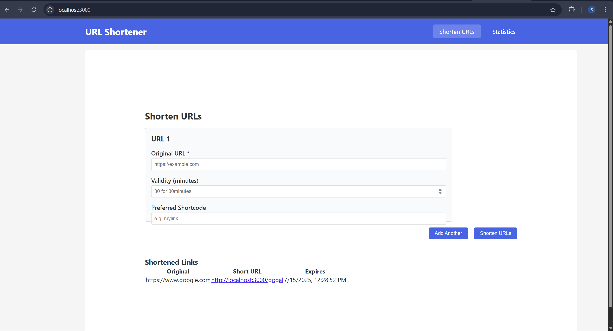
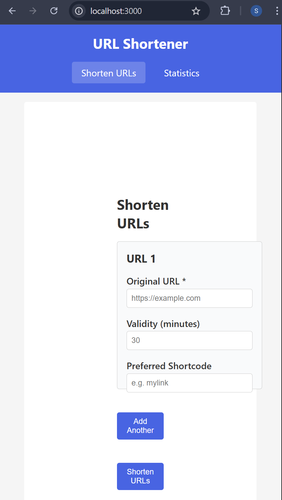

---
#URL Shortener

## Screenshots

### ✅ Home Page (Desktop)

> _Attach screenshot here_


### 📱 Home Page (Mobile)

> _Attach screenshot here_


### 📊 Statistics Page 

> _Attach screenshot here_


---

## Features

- Shorten multiple URLs at once 
- Set custom shortcodes 
- Specify expiration in minutes 
- Redirect simulation for shortened URLs
- Full session-based analytics 


---

## Tech Stack

| Frontend | Details |
|----------|---------|
| Framework | React with Vite |
| Language |JavaScript |
| Styling | Vanilla CSS |
| Routing | React Router DOM |
| Logging | Custom Middleware (via fetch) |

---

## 🛣️ Routes Used

| Path | Component | Purpose |
|------|-----------|---------|
| `/` | `UrlShortener` | Form to shorten URLs |
| `/stats` | `Statistics` | Displays all shortened links |
| `/:shortcode` | `RedirectHandler` | Handles redirection |
| `/404` | `NotFound` | Shown when URL is invalid |

---

## 📦 Getting Started

1. Clone the repo
```bash
git clone https://github.com/your-username/frontend-test.git
cd frontend-test
