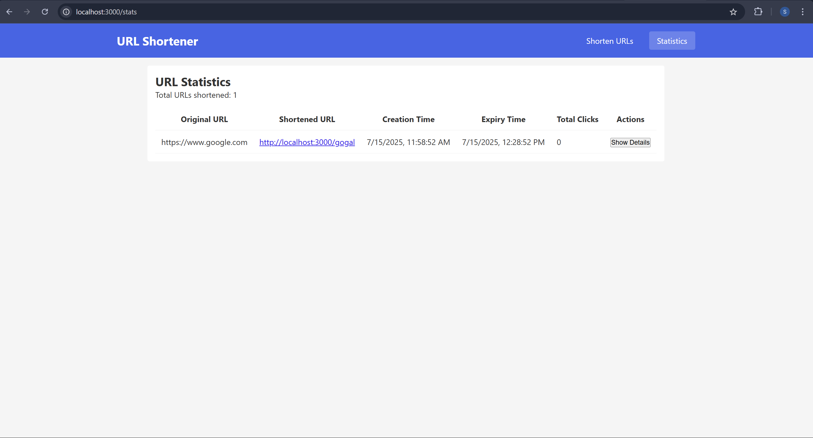

---
# URL Shortener

## Screenshots

### ✅ Home Page (Desktop)


### 📱 Home Page (Mobile)


### 📊 Statistics Page 




### Insomnia Screenshot for test logger( hidden private details)


### Initial implementation of test logger( hidden private details)


---

## Features

- Shorten multiple URLs at once 
- Set custom shortcodes 
- Specify expiration in minutes 
- Redirect simulation for shortened URLs
- Full session-based analytics 


---

## Tech Stack

| Frontend | Details |
|----------|---------|
| Framework | React with Vite |
| Language |JavaScript |
| Styling | Vanilla CSS |
| Routing | React Router DOM |


---

## 🛣️ Routes Used

| Path | Component | Purpose |
|------|-----------|---------|
| `/` | `UrlShortener` | Form to shorten URLs |
| `/stats` | `Statistics` | Displays all shortened links |


---

## 📦 Getting Started

Clone the repo and setup project locally
```bash
git clone https://github.com/your-username/frontend-test.git
cd frontend-test
npm install
npm run dev
